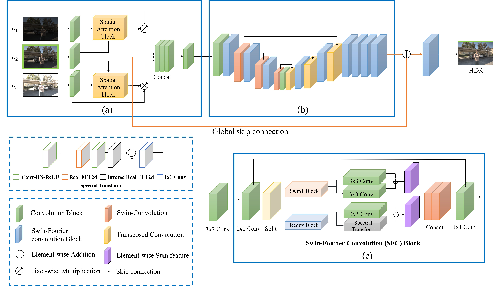

# DRT
<small> Dynamic Range Transformer (DRT): Learning Enhanced Log-Perceptual Information with Swin-Fourier Convolution Network for HDR Imaging

Heunseung Lim, Joongchol Shin, Jinsol Choi, and Joonki Paik. 
In IEEE Conference on Image Processing (ICIP), 2023
\[[Paper](https://ieeexplore.ieee.org/document/10223189)]

  

## Requirements
+ Python 3.8
+ PyTorch 1.9.1
+ MATLAB (for data preparation)


## Usage
### Data preparation
1. Download data from \[[dataset](https://cseweb.ucsd.edu/~viscomp/projects/SIG17HDR/)]
2. Create data using the Matlab executable located in './GeneralH5Data/PrepareData.m'. [AHDR](https://github.com/qingsenyangit/AHDRNet))
 *(GenerH5data folders from [AHDR](https://github.com/qingsenyangit/AHDRNet))
### Testing
1. Install this repository and the required packages. A pretrained model is in `./trained-model`.
2. Prepare dataset.
   1) Download from [[dataset](https://cseweb.ucsd.edu/~viscomp/projects/SIG17HDR/)\]
   2) Import and test the image based on the file in the test-flow.txt file. 
   3) Create and test a testing file using the file in the [AHDR](https://github.com/qingsenyangit/AHDRNet)) Github link './GeneralH5Data/PrepareData.m'
3. Run `python script_testing.py` files. 

### Training
1. Prepare dataset.
2) Download dataset.
3) Similar to testing, create training-only data and learn using the 'script_training.py' file. Hyperparameters must be adjusted.

## Pre-trained model download (.pkl)
https://drive.google.com/file/d/1mdMtj4ZbpeMEohyABlTbhwUG40u1hEyN/view?usp=drive_link


## Citation
If you use this code for your research, please cite our paper.

```
@INPROCEEDINGS{10223189,
  author={Lim, Heunseung and Shin, Joongchol and Choi, Jinsol and Paik, Joonki},
  booktitle={2023 IEEE International Conference on Image Processing (ICIP)}, 
  title={Dynamic Range Transformer (DRT): Learning Enhanced Log-Perceptual Information with Swin-Fourier Convolution Network for HDR Imaging}, 
  year={2023},
  volume={},
  number={},
  pages={3040-3044},
  keywords={Training;Image sensors;Image color analysis;Convolution;Neural networks;Lighting;Dynamic range;high dynamic range;transformer;log-Euclidean metric},
  doi={10.1109/ICIP49359.2023.10223189}}


@article{yan2021dual,
  title={Dual-attention-guided network for ghost-free high dynamic range imaging},
  author={Yan, Qingsen and Gong, Dong and Shi, Javen Qinfeng and van den Hengel, Anton and Shen, Chunhua and Reid, Ian and Zhang, Yanning},
  journal={International Journal of Computer Vision},
  pages={1--19},
  year={2021},
  publisher={Springer}
}
@article{yan2019attention,
  title={Attention-guided Network for Ghost-free High Dynamic Range Imaging},
  author={Yan, Qingsen and Gong, Dong and Shi, Qinfeng and Hengel, Anton van den and Shen, Chunhua and Reid, Ian and Zhang, Yanning},
  journal={IEEE Conference on Computer Vision and Pattern Recognition (CVPR)},
  year={2019}
  pages={1751-1760}
}
```


## Code

Code modified from [AHDR] https://github.com/qingsenyangit/AHDRNet, thanks to Qingsen Yan.


